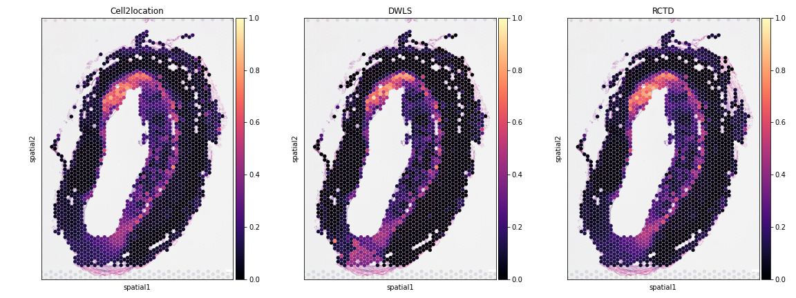

  

# Single Cell Deconvolution of Cardiorenal Spatial Transcriptomics Data

## Data

Single cell RNA reference data were obtained from public sources.

Atherosclerosis scRNA from [Wirka et al. 2019](https://doi.org/10.1038/s41591-019-0512-5), [Pan et al. 2020](https://pubmed.ncbi.nlm.nih.gov/32962412/), and [Alsaigh et al. 2020](https://doi.org/10.1038/s42003-022-04056-7). All of which can be obtained from the [PlaqView Portal](https://www.plaqview.com/).

Kidney scRNA data was obtained from The Kidney Precision Medicine Project [KPMP](https://www.kpmp.org/available-data).

Spatial transcriptomics data was generated internally at Novo Nordisk using 10X Visium technology for FFPE samples.

## Poster

  
